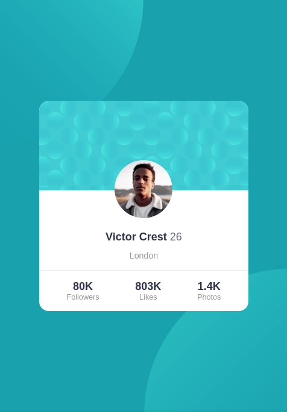

# Frontend Mentor - Profile card component solution

This is a solution to the [Profile card component challenge on Frontend Mentor](https://www.frontendmentor.io/challenges/profile-card-component-cfArpWshJ). Frontend Mentor challenges help you improve your coding skills by building realistic projects.

## Table of contents

-   [Overview](#overview)
    -   [The challenge](#the-challenge)
    -   [Screenshot](#screenshot)
    -   [Links](#links)
-   [My process](#my-process)
    -   [Built with](#built-with)
    -   [What I learned](#what-i-learned)
    -   [Continued development](#continued-development)
    -   [Useful resources](#useful-resources)
-   [Author](#author)
-   [Acknowledgments](#acknowledgments)

## Overview

### The challenge

-   Build out the project to the designs provided

### Screenshot




### Links

-   Solution URL: [Github Repository](https://github.com/juani2/profile-card-component-challenge--solution)
-   Live Site URL: [Netlify](https://optimistic-carson-677dd5.netlify.app/)

## My process

### Built with

-   Semantic HTML
-   Vanilla CSS
-   Flexbox Layout

### What I learned

As a beginner in HTML and CSS, this challenge help me deal with different fundamental CSS concepts.

1. Background Image Positioning - placing the two circles in the upper left and bottom right corner of the screen at any viewport. It takes me a while to pull this off. Upon further study on background image positioning, I arrived at this solution:

```css
.profile-card-section {
    background-color: hsl(185, 75%, 39%);
    background-image: url("/images/bg-pattern-top.svg"), url("/images/bg-pattern-bottom.svg");
    background-repeat: no-repeat, no-repeat;
    background-size: contain, contain;
    background-position: top -35vh left -35vh, bottom -35vh right -35vh;
}
```

2. Negative Margins - placing the center of the profile image above the background pattern on the upper portion of the card. Even this part of the challenge takes me a while, I previously tried absolute and relative positioning as well as transform properties but the most simple one was a 1-line of CSS.

```css
.profile-card-section .profile-card .profile-image {
    margin-top: -66px; /* This value was half of the height of the profile image */
}
```

3. Basic Layout with Flexbox - Flexbox makes it easy to vertically align the card. it also helps in changing the normal flow of elements on the page. For instance, the profile stats on the bottom portion of the card were implemented using standard HTML _Description List_. In the `profile-stats` list, its normal flow would be vertically downward but the challenge requires that the stat components should be layed-out horizontally. See below HTML and CSS snippets.

**HTML Snippet**

```html
<dl class="profile-stats">
    <div class="stat">
        <dt class="stat-name">followers</dt>
        <dd class="stat-value">80K</dd>
    </div>
    <div class="stat">
        <dt class="stat-name">likes</dt>
        <dd class="stat-value">803K</dd>
    </div>
    <div class="stat">
        <dt class="stat-name">photos</dt>
        <dd class="stat-value">1.4K</dd>
    </div>
</dl>
```

**CSS Snippet**

```css
/** Only Flex portion of styles were shown for readablity purposes **/
.profile-card-section .profile-card .profile-stats {
    display: flex;
    justify-content: space-around;
}
.profile-card-section .profile-card .profile-stats .stat {
    display: flex;
    flex-direction: column-reverse; /* Switch the ordering of dt and dd elements */
}
```

### Continued development

This challenge allows me to practice basic HTML/CSS concepts and it enhances my vanilla CSS coding.
I desire to further improve my Vanilla CSS skills by taking more challenges.

### Useful resources

-   [Example resource 1](https://developer.mozilla.org/) - This helped me understand and try fundamental HTML semantics and CSS concepts to pull this whole challenge off.
-   [Type-Scale](https://type-scale.com/) - I used this tool to help me decide proportional font sizes on this challenge.
- [CSS Generator](https://cssgenerator.org/box-shadow-css-generator.html) - I used this tool for the card shadow. Very handy.

## Author

-   Frontend Mentor - [@juani2](https://www.frontendmentor.io/profile/juani2)
-   Github - [@juani2](http://github.com/juani2)

## Acknowledgments

I want to give thanks to Frontend mentor team and all those challengers that posts their solution. It really helped me in pulling this challenge off.
